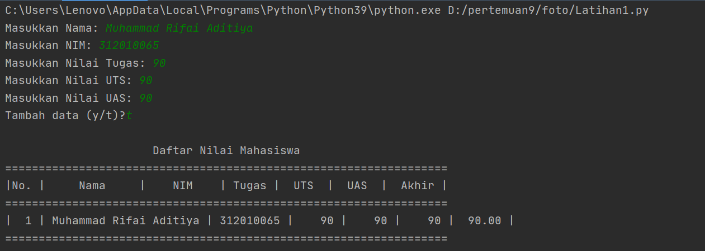
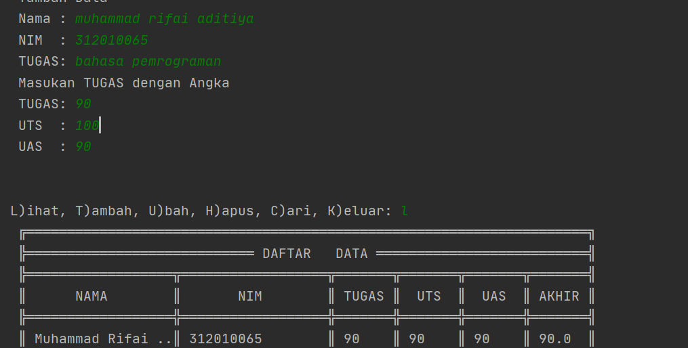

##  pertemuan9
##  Nama:Muhammad Rifai Aditiya
## Kelas:TI.20.A1
## NIM:312010065
## MATKUL: BAHASA PEMROGRAMAN
__________________________________________________________________
## Program Data Mahasiswa
pada praktikum 4 ini, saya akan membuat program sederhana untuk menginput data kedalam list.


```python

## Berikut Inputannya :
nilai = []
ulang = True

while ulang:
    nama = input("Masukkan Nama: ")
    nim = input("Masukkan NIM: ")
    tugas = int(input("Masukkan Nilai Tugas: "))
    uts = int(input("Masukkan Nilai UTS: "))
    uas = int(input("Masukkan Nilai UAS: "))
    akhir = (tugas * 30/100) + (uts * 35/100) + (uas * 35/100)

    nilai.append([nama, nim, tugas, uts, uas, int(akhir)])
    if (input("Tambah data (y/t)?") == 't'):
        ulang = False

print("\n                      Daftar Nilai Mahasiswa")
print("==================================================================")
print("|No. |     Nama     |    NIM    | Tugas |  UTS  |  UAS  |  Akhir |")
print("==================================================================")
i = 0
for item in nilai:
    i += 1
    print("| {no:2d} | {nama:12s} | {nim:9s} | {tugas:5d} | {uts:5d} | {uas:5d} | {akhir:6.2f} |"
          .format(no=i, nama=item[0], nim=item[1], tugas=item[2], uts=item[3], uas=item[4], akhir=item[5]))
print("==================================================================")

```

Setelah Kita memasukan inputan dibawah ini ini lah hasil inputan Tersebut

Dan Setelah Kita Menemukan Hasil Nya Mari Saya Jelaskan Perinciannya

1.) Langkah  Pertama  Yang Harus Lakukan Adalahkita membuat variable list kosong.

nilai = []
ulang = True
Variable ulang = True digunakan untuk mengontrol perulangan.

2.) Setelah itu  kita membuat kondisi perulangan dan statement yang akan dijalankan ketika perulangan terjadi.
    Dan Ini inputannya

     while ulang:
    nama = input("Masukkan Nama: ")
    nim = input("Masukkan NIM: ")
    tugas = int(input("Masukkan Nilai Tugas: "))
    uts = int(input("Masukkan Nilai UTS: "))
    uas = int(input("Masukkan Nilai UTS: "))
    akhir = (tugas * 30/100) + (uts * 35/100) + (uas * 35/100)

    nilai.append([nama, nim, tugas, uts, uas, int(akhir)])
 Dari statement  yang kita masukan diatas, kita akan diminta untuk menginput nama, nim, nilai tugas, nilai uts, dan nilai uas, lalu system akan menjumlahkan nilai-nilai tersebut dan menghasilkan nilai akhir. Setelah menginput berbagai data atau item, inputan item tersebut akan masuk ke dalam list 'nilai'
 3.) Setelah membuat perulangan, kita membuat statement untuk menghentikan atau keluar dari perulangan yang terjadi.

    if (input("Tambah data (y/t)?") == 't'):
        ulang = False
Untuk keluar dari perulangan kita hanya perlu menginputkan 't' apabila diminta pada saat program dijalankan. 't' akan membuat variable ulang = True menjadi ulang = False yang mana akan menghentikan perulangan yang terjadi.

4.) Terakhir kita akan mencetak hasil dari program yang telah dibuat.

```python

print("\n                      Daftar Nilai Mahasiswa")
print("==================================================================")
print("|No. |     Nama     |    NIM    | Tugas |  UTS  |  UAS  |  Akhir |")
print("==================================================================")
i = 0
for item in nilai:
    i += 1
    print("| {no:2d} | {nama:12s} | {nim:9s} | {tugas:5d} | {uts:5d} | {uas:5d} | {akhir:6.2f} |"
          .format(no=i, nama=item[0], nim=item[1], tugas=item[2], uts=item[3], uas=item[4], akhir=item[5]))
print("==================================================================")
Setelah ini selanjutnya kita akan membuat flowcart Sebagai Berikut

```


## Pertemuan 9 Modul 5
Pada Pertemuan 9 Modul 5 dosen memberikan saya tugas untuk membuat program sederhana yang akan menampilkan daftar nilai mahasiswa. berikut soal yang dosen berikan:

Penjelasan:
Penggunaan if c.lower() if c.lower() fungsinya apabila user menginputkan dengan huruf besar, maka otomatis akan menjadi huruf kecil sehingga kondisi yang diinginkan tercapai. contoh:
```python
if c.lower() == 'q'
```
Penggunaan while True while True berfungsi untuk mendeteksi jika format yang diinputkan bukan berupa type maka akan muncul eror
*Penggunaan else Fungsi else ialah jika tidak eror dan type yang dimasukan sesuai maka proses while True
Pengunaan valueError Fungsinya apabila diinputkan bukan berupa type maka hasilnya error (valueError)
berikut source codenya:
```python
             while (True):
                        nama = input(" Nama : ")
                        if nama == '':
                            P(' Masukan dengan Nama Dengan Benar')
                        else:
                            break
                    while (True):
                        try:
                            nim  = int(input(" NIM  : "))
                            if nim == '':
                                P(' Masukan Nim dengan Angka')
                        except ValueError:
                            P(' Masukan Nim dengan Angka')
                        else:
                            break
                    while (True):
                        try:
                            tugas  = int(input(" TUGAS  : "))
                            if tugas == '':
                                P(' Masukan TUGAS dengan Angka')
                        except ValueError:
                            P(' Masukan TUGAS dengan Angka')
                        else:
                            break
 
```
Pengunaan round dan float round digunakan untuk menentukan banyaknya angka di belakang koma, sedangkan float digunakan untuk mengubah bilangan menjadi float(desimal)
Berukut Source codenya:
akhir = round((float(tugas) * 0.3)+(float(uts) * 0.35)+(float(uas) * 0.35),2)
        i.write('\nNama : '+nama+'|Nim : '+str(nim)+'|Tugas : '+str(tugas)+'|UTS : '+str(uts)+'|UAS : '+str(uas)+"|Akhir : "+str(akhir)+'\n')
        i.close()
        Berikut Source code lengkapnya...
#Membuat Program Sederhana Menampilkan Daftar Nilai Mahasiswa
#Koding By: Muhammad Rifai Aditiya
#TI.20.A.1
#Pertemuan 9 Praktikum 5
pada praktikum 5 ini, saya akan membuat program sederhana untuk menginput data kedalam list.
 ```python
P = print
while True:
    P("")
    P("")
    c = input("L)ihat, T)ambah, U)bah, H)apus, C)ari, K)eluar: ")
    if c.lower() == 'q':
        break
    elif c.lower() == 'l':
        i = open('database.txt','r').read().splitlines()
        P(" ╔═════════════════════════════════════════════════════════════════════╗")
        P(" ╠════════════════════════════ DAFTAR   DATA ══════════════════════════╣")
        P(" ╠══════════════════╦══════════════════╦═══════╦═══════╦═══════╦═══════╣")
        P(" ║      NAMA        ║       NIM        ║ TUGAS ║  UTS  ║  UAS  ║ AKHIR ║")
        P(" ╠══════════════════╬══════════════════╬═══════╬═══════╬═══════╬═══════╣")
        for l in i:
            if l == '':
                pass
            else:
                l1 = l.replace('Nama : ','').replace('Nim : ','').replace('Tugas : ','').replace('UTS : ','').replace('UAS : ','').replace('Akhir : ','')
                na,ni,tu,uts,uas,akhir = l1.strip().split('|')
                P((' ║ ')+(na[:15]).ljust(17,'.')+('║ ')+(ni).ljust(17)+('║ ')+(tu).ljust(6)+('║ ')+(uts).ljust(6)+('║ ')+(uas).ljust(6)+('║ ')+(akhir).ljust(6)+('║'))
        P(" ╚══════════════════╩══════════════════╩═══════╩═══════╩═══════╩═══════╝")
    elif c.lower() == 'c':
        cari = input(' Mencari : ')
        i = open('database.txt','r').read().splitlines()
        P(" ╔═════════════════════════════════════════════════════════════════════╗")
        P(" ╠════════════════════════════ DAFTAR   DATA ══════════════════════════╣")
        P(" ╠══════════════════╦══════════════════╦═══════╦═══════╦═══════╦═══════╣")
        P(" ║      NAMA        ║       NIM        ║ TUGAS ║  UTS  ║  UAS  ║ AKHIR ║")
        P(" ╠══════════════════╬══════════════════╬═══════╬═══════╬═══════╬═══════╣")
        for l in i:
            if l == '':
                pass
            elif cari in l:
                l1 = l.replace('Nama : ','').replace('Nim : ','').replace('Tugas : ','').replace('UTS : ','').replace('UAS : ','').replace('Akhir : ','')
                na,ni,tu,uts,uas,akhir = l1.strip().split('|')
                P((' ║ ')+(na).ljust(17)+('║ ')+(ni).ljust(17)+('║ ')+(tu).ljust(6)+('║ ')+(uts).ljust(6)+('║ ')+(uas).ljust(6)+('║ ')+(akhir).ljust(6)+('║'))
        P(" ╚══════════════════╩══════════════════╩═══════╩═══════╩═══════╩═══════╝")
    elif c.lower() == 'h':
        u = open('database.txt','r').read().splitlines()
        target = input(' Masukan Nama : ')
        nm = []
        for l in u:
            if l == '':
                pass
            else:
                l1 = l.replace('Nama : ','').replace('Nim : ','').replace('Tugas : ','').replace('UTS : ','').replace('UAS : ','').replace('Akhir : ','')
                na,ni,tu,uts,uas,akhir = l1.strip().split('|')
                if str(na) == str(target):
                    P('BERHASIL MENGHAPUS Data %s'%(target))
                    pass
                else:
                    nm.append(str(l)+'\n')
        new = open('database.txt','w')
        new.write(str(nm))
        new.close()
        new = open('database.txt','r').read().splitlines()
        new1 = open('database.txt','w')
        new1.close()
        new2 = open('database.txt','a')
        for i in new:
            i2 = i.replace("['","").replace("\\n', '", "\n").replace("']","").replace("\\n",'')
            new2.write(i2)
        new2.close()
    elif c.lower() == 'u':
        u = open('database.txt','r').read().splitlines()
        target = input(' Masukan Nama : ')
        nm = []
        for l in u:
            if l == '':
                pass
            else:
                l1 = l.replace('Nama : ','').replace('Nim : ','').replace('Tugas : ','').replace('UTS : ','').replace('UAS : ','').replace('Akhir : ','')
                na,ni,tu,uts,uas,akhir = l1.strip().split('|')
                if na == target:
                    P(' Mengedit Data %s'%(target))
                    while (True):
                        nama = input(" Nama : ")
                        if nama == '':
                            P(' Masukan dengan Nama Dengan Benar')
                        else:
                            break
                    while (True):
                        try:
                            nim  = int(input(" NIM  : "))
                            if nim == '':
                                P(' Masukan Nim dengan Angka')
                        except ValueError:
                            P(' Masukan Nim dengan Angka')
                        else:
                            break
                    while (True):
                        try:
                            tugas  = int(input(" TUGAS  : "))
                            if tugas == '':
                                P(' Masukan TUGAS dengan Angka')
                        except ValueError:
                            P(' Masukan TUGAS dengan Angka')
                        else:
                            break
                    while (True):
                        try:
                            uts  = int(input(" UTS  : "))
                            if uts == '':
                                P(' Masukan UTS dengan Angka')
                        except ValueError:
                            P(' Masukan UTS dengan Angka')
                        else:
                            break
                    while (True):
                        try:
                            uas  = int(input(" UAS  : "))
                            if uas == '':
                                P(' Masukan UAS dengan Angka')
                        except ValueError:
                            P(' Masukan UAS dengan Angka')
                        else:
                            break
                    akhir = round((float(tugas) * 0.3)+(float(uts) * 0.35)+(float(uas) * 0.35),2)
                    edit  =('Nama : '+nama+'|Nim : '+str(nim)+'|Tugas : '+str(tugas)+'|UTS : '+str(uts)+'|UAS : '+str(uas)+"|Akhir : "+str(akhir)+'\n')
                    nm.append(edit+'\n')
                else:
                    nm.append(str(l)+'\n')
        new = open('database.txt','w')
        new.write(str(nm))
        new.close()
        new = open('database.txt','r').read().splitlines()
        new1 = open('database.txt','w')
        new1.close()
        new2 = open('database.txt','a')
        for i in new:
            i2 = i.replace("['","").replace("\\n', '", "\n").replace("']","").replace("\\n","\n")
            new2.write(i2+'\n')
        new2.close()
    elif c.lower() == 't':
        i = open('database.txt','a')
        P(" Tambah Data")
        while (True):
            nama = input(" Nama : ")
            if nama == '':
                P(' Masukan dengan Nama Dengan Benar')
            else:
                break
        while (True):
            try:
                nim  = int(input(" NIM  : "))
                if nim == '':
                    P(' Masukan Nim dengan Angka')
            except ValueError:
                P(' Masukan Nim dengan Angka')
            else:
                break
        while (True):
            try:
                tugas  = int(input(" TUGAS: "))
                if tugas == '':
                    P(' Masukan TUGAS dengan Angka')
            except ValueError:
                P(' Masukan TUGAS dengan Angka')
            else:
                break
        while (True):
            try:
                uts  = int(input(" UTS  : "))
                if uts == '':
                    P(' Masukan UTS dengan Angka')
            except ValueError:
                P(' Masukan UTS dengan Angka')
            else:
                break
        while (True):
            try:
                uas  = int(input(" UAS  : "))
                if uas == '':
                    P(' Masukan UAS dengan Angka')
            except ValueError:
                P(' Masukan UAS dengan Angka')
            else:
                break
        akhir = round((float(tugas) * 0.3)+(float(uts) * 0.35)+(float(uas) * 0.35),2)
        i.write('\nNama : '+nama+'|Nim : '+str(nim)+'|Tugas : '+str(tugas)+'|UTS : '+str(uts)+'|UAS : '+str(uas)+"|Akhir : "+str(akhir)+'\n')
        i.close()
    else:
        P("Silahkan pilih menu yang tersedia...")
```
Dari statement diatas, kita akan diminta untuk menginput nama, nim, nilai tugas, nilai uts, dan nilai uas, lalu system akan menjumlahkan nilai-nilai tersebut dan menghasilkan nilai akhir.
Setelah menginput berbagai data atau item, inputan item tersebut akan masuk ke dalam list 'nilai'

Terakhir kita akan mencetak hasil dari program yang telah dibuat.

## Terimakasih